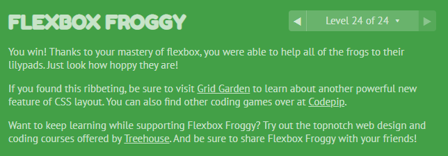

# summary class 03

the template is Html file. Mustache **logic-less** because there are no if statements, else clauses, or for loops. Instead, there are only tags.
I learned how can use variable and function. we need to install mustach global.

## flex 
is a value of display, in the flex there a some of properties for parent and another for children.

properties for parent:
1. display
2. flex-direction
3. flex-wrap
4. flex-flow it contain two properties flex-wrap and flex-direction
5. justify-content
6. align-items
7. align-content

properties for children:
1. order
2. flex-grow
3. flex-shrink
4. flex-basis
5. flex  shorthand for flex-grow, flex-shrink and flex-basis combined
6. align-self

I complete the game and I learned more a bout flex

