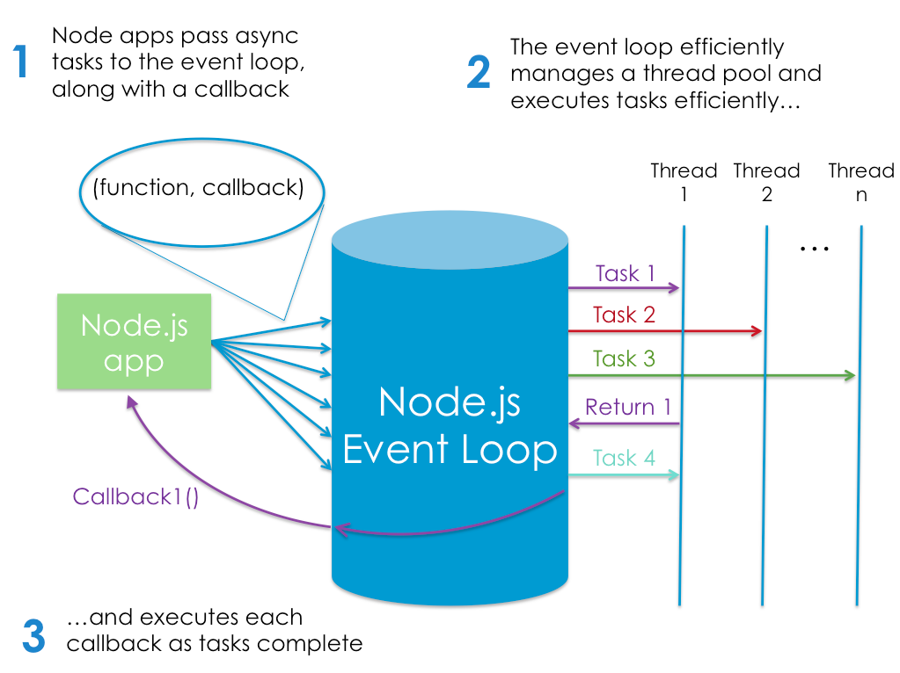

# summary Read 06

Node.js is build in Google V8 JavaScript engin. this engin  is open source. I can check if the node install in my computer bu command node -v. the main cause to use Node.js is runing javascript on server.

- Node has excellent support for ECMAScript 2015 (ES6) and beyond.
- Node comes bundled with a package manager called npm.
- The anonymous function is called with two arguments (request and response). These contain the request from the user and the response.
- Node.js is an event-based, non-blocking, asynchronous I/O runtime that uses Google’s V8 JavaScript engine and libuv library.

